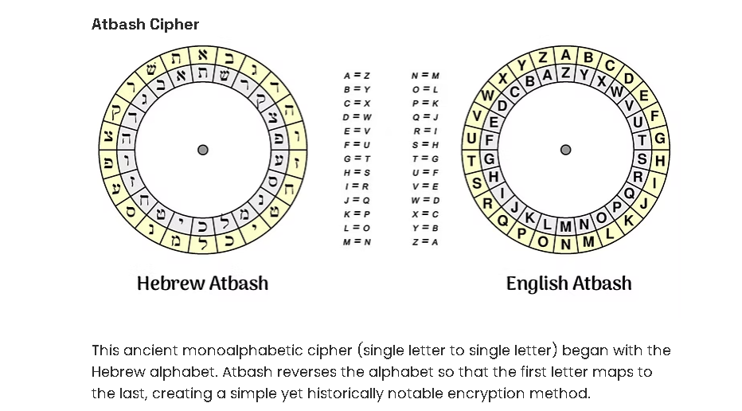

<h1><p align="center" font><bold>Bash Cipher</bold></p></h1>

<p align="center">
  
</p>

<p align="center">
  <strong>A typeface and interactive showcase built around the ancient Atbash cipher.</strong>
</p>

<p align="center">
  <a href="#demo">Demo</a> &bull;
  <a href="#features">Features</a> &bull;
  <a href="#usage">Usage</a> &bull;
  <a href="#the-cipher">The Cipher</a> &bull;
  <a href="#license">License</a>
</p>

---

## Overview

AtBash Cipher is a typeface and interactive web experience based on the Atbash cipher, one of the oldest known substitution ciphers. The cipher reverses the alphabet so that the first letter maps to the last, the second to the second to last, and so on. This project brings that ancient encryption method into a modern, interactive digital format.

## Demo

[Live Demo](https://be-akverse.github.io/Atbash-Cipher/) &mdash; Try the live encoder!

## Features

- **Interactive Live Encoder** &mdash; Type plaintext and watch it convert to ciphertext in real time
- **Substitution Matrix** &mdash; Visual grid showing every letter mapping

## The Cipher

The Atbash cipher is a monoalphabetic substitution cipher that reverses the alphabet:

| Plain | A | B | C | D | E | F | G | H | I | J | K | L | M |
|-------|---|---|---|---|---|---|---|---|---|---|---|---|---|
| Cipher| Z | Y | X | W | V | U | T | S | R | Q | P | O | N |

| Plain | N | O | P | Q | R | S | T | U | V | W | X | Y | Z |
|-------|---|---|---|---|---|---|---|---|---|---|---|---|---|
| Cipher| M | L | K | J | I | H | G | F | E | D | C | B | A |

Because the cipher is self-inverse, applying it twice returns the original text. Encryption and decryption are the same operation.

## Usage

### Embedding the Font

The typeface can be used in any web project by including the font files and referencing them in CSS:

```css
@font-face {
  font-family: 'AtBashCipher';
  src: url('fonts/Atash_Cipher-Regular.ttf') format('truetype');
}
```
## License

MIT License. See [LICENSE](LICENSE) for details.

## Acknowledgments

- The Atbash cipher has roots in biblical Hebrew texts, notably appearing in the Book of Jeremiah and Ezekiel.
- Inspired by the intersection of ancient cryptography and modern digital design.

---

<p align="center">
  Built with pure HTML, CSS, and JavaScript. No frameworks. No dependencies.
</p>
